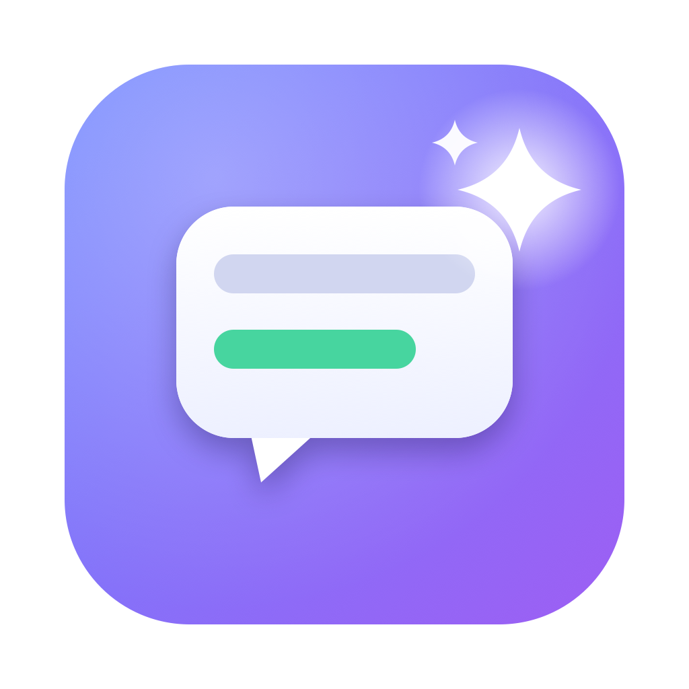

# Legenda AI pra mim

App de computador (Mac, Windows e Linux) para **baixar, traduzir e assistir**
legendas dos seus vídeos — direto na sua TV, se quiser. Simples, offline quando
dá, e sem enviar seus arquivos pra lugar nenhum.

## O que ele faz

- 🔎 **Baixa a legenda certa** — acha no OpenSubtitles pelo "impressão digital" do
  vídeo, então vem **100% sincronizada** (nada de legenda adiantada/atrasada).
- 🌎 **Traduz legendas** para o seu idioma, **mantendo a sincronia**. Funciona com
  legenda embutida no vídeo (MKV) ou com um arquivo `.srt` que você já tem. Três
  opções de tradução:
  - **Apple** — no próprio Mac, offline e grátis (macOS 15+);
  - **Ollama** — offline no seu computador (grátis, precisa instalar);
  - **Azure** — na nuvem (precisa de uma conta Microsoft).
- 👁️ **Lê legendas "em imagem"** de Blu-ray (aquelas que não são texto) e vira
  texto pra poder traduzir.
- 📺 **Toca na TV (Chromecast)** — manda o vídeo **com a legenda** pra sua TV, e
  ainda **converte na hora** formatos que a TV não aceita (ex.: filmes em x265),
  com a barra de tempo funcionando (pular pra frente/trás).

## Baixar e instalar

Pegue a versão mais recente na página de **[Releases](https://github.com/abraaoz/legenda-ai/releases/latest)**:

- **Mac (Apple Silicon)** → baixe o `.dmg`, abra e arraste pra Aplicativos.
- **Windows** → baixe o `.zip`, extraia e rode.
- **Linux** → baixe o `.tar.gz`.

> ⚠️ O app ainda **não é assinado**, então na primeira vez o sistema pode avisar
> que é de "desenvolvedor não identificado". No Mac: clique com o botão direito →
> **Abrir**. No Windows: **Mais informações → Executar assim mesmo**.

Depois de instalado, o app se **atualiza sozinho** (menu **Legenda AI pra mim →
Buscar atualizações…**).

## O que você precisa ter

- **ffmpeg** (para ler legendas embutidas e converter vídeo pra TV):
  no Mac, `brew install ffmpeg`. O app avisa se estiver faltando.
- **Chave do OpenSubtitles** (só para baixar legendas): crie grátis em
  [opensubtitles.com](https://www.opensubtitles.com) → *Consumers* → gere uma
  *API Key* e cole em **⚙️ Configurações**.
- Para **traduzir**: no Mac não precisa de nada (usa o tradutor da Apple). Fora do
  Mac, instale o [Ollama](https://ollama.com) ou use uma chave do Azure.

## Como usar

1. **Adicione vídeos** — botão *Selecionar vídeos* (ou uma pasta inteira).
2. **Baixar legenda** — *Buscar no OpenSubtitles* → *Baixar* na que tiver o selo
   de sincronizada.
3. **Traduzir** — clique em *Traduzir* numa faixa embutida ou numa legenda `.srt`
   que não esteja no seu idioma. A legenda traduzida é salva **ao lado do vídeo**
   (ex.: `Filme.pt-br.srt`), pronta pra qualquer player.
4. **Assistir na TV** — *📺 Tocar na TV*, escolha o Chromecast e a legenda, e dê
   play. Use a barrinha de tempo para pular.

Tudo o que o app faz aparece em tempo real na **coluna de log** à direita.

## Privacidade

Seus vídeos **nunca saem do seu computador**. A tradução pela Apple/Ollama é 100%
local. Só o texto da legenda é enviado se você escolher o Azure (nuvem).

---

Feito com [Bun](https://bun.sh) + [Electrobun](https://electrobun.dev) (sem
Node/Electron). Quer contribuir ou entender por dentro? Veja o [DEV.md](DEV.md).
Licença MIT.
